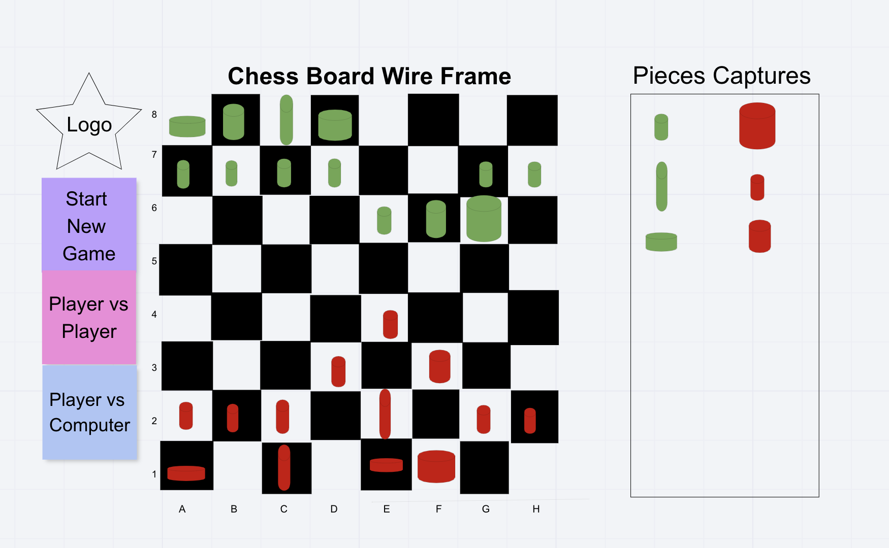
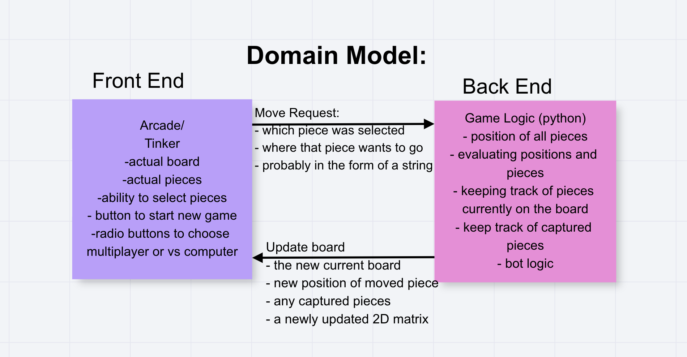

# Chess-Arcade

## Contributors: Robert Radford, Yoni Palagashvili, Ryan Pilon, Brendan Welzien

 This project encompasses a reproduction of the game of chess in a virtual format. The chess board contains the pieces and its accompanying abilities as one would see when playing a normal game of chess. The user will have the ability to make moves according to the current placement of the chess pieces.

 ## Wireframing
 
 

 ## Scope
 ### In / Out
 - Create a visually appealing application by using *Arcade*
 - Application to have all chess pieces with its given moveset
 - Local two-player version

 ## Feature Tasks
 - Create a UI for the Chess Board with visual representations of chess pieces
 - Chess pieces can move according to their moveset
 - Ability to castle
 - Ability to promote a *pawn* to a *queen*
 - Ability to *check* and *checkmate*
 - Players restricted to only choosing their colored pieces and game maintains turn-based play
 - Chess-Arcade to have an end game scenario

## Structure
- Grid object for chess board
- Chess piece super class
- Board Logic
- Edge Case methods for check, checkmate, and a pawn's initial movement (up to 2 spaces)
- Individual chess piece movement methods (Pawn, Knight, Bishop, Rook, Queen, King)
- Create a movement list and an attack list for chess pieces

## Functionality

1. A user can play chess games.
3. A user can win or lose the game.
4. A user can visually see board movement.

## Non-Functional Requirements

This project requires problem-solving and critical-thinking to properly create the chess board logic.
It requires the creators to pay close attention to detail since there are any possibilities/edge cases to consider when making the chess game. 
It aims to provide entertainment to users where they can tinker with the game moves and ultimately try to win.